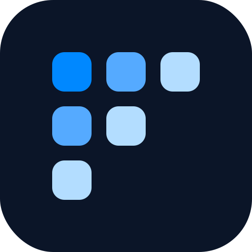

  

<h1 align="center">Foglight</h1>

  Connect AI agents to your infrastructure.

  
  

---

Engineers context-switch across dozens of tools during debugging and incident response. AI agents can help — but they need real-time access to infrastructure data.

Foglight is an open-source MCP server that gives AI agents a single, secure connection to your full engineering stack.

- **Simple setup** — one command to start locally, Helm chart for Kubernetes, works with any MCP-compatible IDE
- **Secure by design** — outbound-only connections, read-only by default, data never leaves your perimeter
- **Open source** — Apache 2.0, audit every line that touches your infrastructure

## Integrations

| Integration | Status |
|---|---|
| GitHub | Coming Soon |
| Grafana | Coming Soon |
| Datadog | Coming Soon |
| Slack | Coming Soon |
| Linear | Coming Soon |
| Notion | Coming Soon |

## Examples

Here are a few things you can do with Foglight connected to your stack.

### "Catch me up on this project"

Instead of opening multiple tabs to piece together what's going on, ask your AI agent. Foglight pulls it all at once:

- Recent merges, open PRs, and build status from **GitHub**
- Active alerts and error rates from **Grafana/Datadog**
- Open issues and current blockers from **Linear**
- Recent team discussions from **Slack**
- Updated docs and specs from **Notion**

You're up to speed in seconds, not twenty minutes.

### "Help me write this ticket"

You found a bug. Instead of filing a vague one-liner, describe what you see. Foglight fills in the rest:

- Error rates and logs for the affected code path from **Grafana/Datadog**
- Similar or duplicate issues from **Linear**
- Recent changes and related PRs from **GitHub**
- Related conversations from **Slack**
- Relevant docs and specs from **Notion**

The result is a clear, concise ticket that someone can pick up and act on.

---

  <a href="https://docs.foglight.co"><strong>Explore Docs</strong></a> · <a href="https://foglight.co"><strong>Visit foglight.co</strong></a>

## License

[Apache 2.0](LICENSE)
